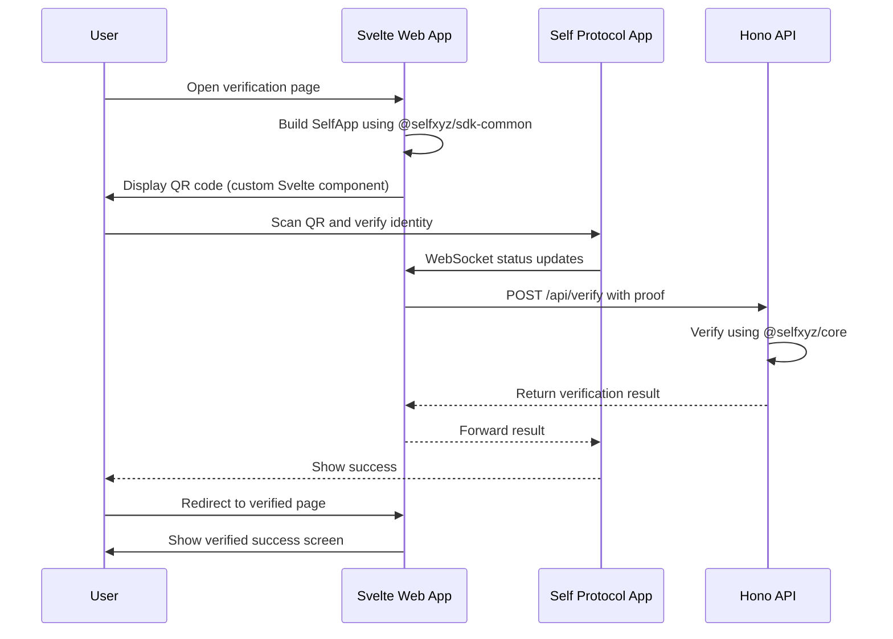

# Migration Plan: Next.js/React to Svelte + Hono Backend

## SDK Architecture Analysis

Based on examining `./tmp/self/sdk`:

### Available Packages
1. **`@selfxyz/sdk-common`** (framework-agnostic ✓)
   - `SelfAppBuilder` class
   - `getUniversalLink()` function
   - `countries` export
   - Type definitions (`SelfApp`, `SelfAppDisclosureConfig`, etc.)

2. **`@selfxyz/qrcode`** (React-specific ❌)
   - Has React as peer dependency
   - Uses `qrcode.react` for QR generation
   - Uses `socket.io-client` for real-time verification status

3. **`@selfxyz/core`** (framework-agnostic ✓)
   - `SelfBackendVerifier` for backend verification

### Challenge
The QR code component (`@selfxyz/qrcode`) is React-specific. For Svelte, we need to:
- Use `@selfxyz/sdk-common` for app configuration
- Create custom Svelte components for QR display and WebSocket handling

---

## Current Architecture

```
app/                          # Next.js/React app (to be replaced)
├── app/page.tsx              # Main verification page with QR code
├── app/api/verify/route.ts   # Verification API endpoint
└── app/verified/page.tsx     # Verification success page

backend/                      # Hono backend (Cloudflare Workers)
├── src/index.ts              # Basic Hono server setup
└── src/worker.ts             # Worker entry point

web/                          # Svelte app (to be enhanced)
├── src/routes/+page.svelte  # Basic template page
└── package.json              # Current dependencies
```

---

## Target Architecture

```
backend/                      # Hono backend (Cloudflare Workers)
├── src/index.ts              # Hono server with /api/verify endpoint
├── src/worker.ts             # Worker entry point
└── src/env.ts                # Environment types

web/                          # Svelte app
├── src/routes/
│   ├── +page.svelte          # Main verification page with QR code
│   └── verified/
│       └── +page.svelte      # Verification success page
├── src/lib/
│   └── self/                 # Self.xyz Svelte integration
│       ├── SelfQRCode.svelte # Custom QR code component
│       └── verification.ts   # WebSocket and verification logic
└── package.json              # Updated with Self dependencies
```

---

## Migration Steps

### 1. Update Backend (Hono)

- Add `/api/verify` POST endpoint to `backend/src/index.ts`
- Use `@selfxyz/core` for verification logic (framework-agnostic)
- Add `@selfxyz/core` and `@selfxyz/sdk-common` to `backend/package.json`
- Add environment variable handling for:
  - `SELF_SCOPE_SEED`
  - `SELF_ENDPOINT`
  - Environment mode (staging/production)

### 2. Update Web (Svelte) Dependencies

Add to `web/package.json`:
```json
{
  "dependencies": {
    "@selfxyz/sdk-common": "file:../tmp/self/sdk/sdk-common",
    "@selfxyz/core": "file:../tmp/self/sdk/core",
    "ethers": "^6.14.4",
    "qrcode": "^1.5.3",
    "socket.io-client": "^4.8.3"
  }
}
```

### 3. Create Svelte QR Code Component

Create `web/src/lib/self/SelfQRCode.svelte`:
- Use `qrcode` npm package for QR generation (framework-agnostic)
- Import and use `initWebSocket` logic from SDK
- Replicate status handling from `@selfxyz/qrcode/utils/utils.ts`

### 4. Migrate Main Verification Page

Convert `app/app/page.tsx` (React) → `web/src/routes/+page.svelte` (Svelte)

Key components to port:
- SelfAppBuilder configuration from `@selfxyz/sdk-common`
- QR code display using custom Svelte component
- Copy to clipboard functionality
- Open Self App functionality
- Toast notifications
- User address display

### 5. Migrate Verified Success Page

Convert `app/app/verified/page.tsx` (React) → `web/src/routes/verified/+page.svelte` (Svelte)

### 6. Configure Environment Variables

Create `web/.env`:
```
PUBLIC_SELF_APP_NAME=self-workshop
PUBLIC_SELF_SCOPE_SEED=self-workshop
PUBLIC_SELF_ENDPOINT=http://localhost:34005/api/verify
```

---

## Verification Flow



---

## Key Technical Decisions

| Aspect | Decision | Rationale |
|--------|----------|------------|
| QR Library | `qrcode` npm package | Framework-agnostic, works with Svelte |
| WebSocket | Custom implementation | Reuse logic from `@selfxyz/qrcode/utils/websocket.ts` |
| SDK Common | Local file reference | Use SDK from `./tmp/self/sdk/sdk-common` |
| Backend Core | Local file reference | Use SDK from `./tmp/self/sdk/core` |

---

## Files to Create/Modify

### Backend
- `backend/package.json` - Add SDK dependencies
- `backend/src/index.ts` - Add `/api/verify` endpoint

### Web
- `web/package.json` - Add SDK and QR dependencies
- `web/src/lib/self/SelfQRCode.svelte` - Custom QR component
- `web/src/lib/self/verification.ts` - WebSocket utilities
- `web/src/routes/+page.svelte` - Main verification page
- `web/src/routes/verified/+page.svelte` - Success page
- `web/.env` - Environment variables
